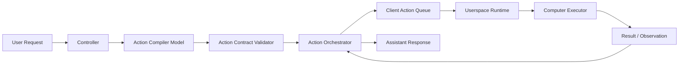

# Computer Use Action Plan

이 문서는 JARVIS가 Codex computer use처럼 사용자의 컴퓨터에서 여러 액션을 안전하게 수행하기 위한 설계 계획이다.

목표는 자연어 인텐트를 코드에 하드코딩하지 않고, 모델이 액션 계획을 만들며, Controller는 계약 검증과 실행 오케스트레이션을 맡고, Userspace는 로컬 PC executor로 동작하는 구조를 만드는 것이다.

## 1. 현재 문제

현재 "브라우저 켜서 연어장 찾아줘" 같은 요청도 안정적으로 실행되지 않는다.

대표 실패 흐름:

```text
User: 브라우저 켜서 연어장 찾아줘
Core/assistant: app_control target=browser
Userspace: app_control target=browser는 추상 target이라 거부
Controller: 실패 결과를 성공 문구처럼 conversation.done으로 전달
Frontend: 사용자는 실행된 것처럼 보지만 실제로는 아무 일도 일어나지 않음
```

핵심 원인:

- 액션 타입이 추상도가 섞여 있다. `app_control`, `open_url`, `browser_control`, `keyboard_type`이 같은 레벨에서 경쟁한다.
- `browser`가 앱인지 브라우저 capability인지 계약상 명확하지 않다.
- Controller가 모델 출력과 실행 결과를 충분히 검증하지 않는다.
- Userspace는 브라우저 기본 primitive가 부족하다.
- Frontend 설정은 capability, 권한, 확인 정책을 세밀하게 다루지 못한다.

## 2. 설계 원칙

- 사용자 자연어 인텐트는 코드에서 파싱하지 않는다.
- Controller는 자연어를 직접 해석하지 않고, action compiler model에 맡긴다.
- Controller는 모델 출력의 schema, capability, policy만 검증한다.
- 잘못된 action은 조용히 수정하지 않는다. 거부하거나 모델에 재컴파일을 요청한다.
- Userspace는 자연어를 해석하지 않는다. 이미 구조화된 action만 실행한다.
- Frontend는 assistant text, markdown action block, 임의 JSON을 실행하지 않는다.
- 실제 실행 권위는 backend가 발급한 `action_id`가 있는 queued action에만 있다.
- 실행 결과가 실패면 UI와 assistant completion도 실패로 표시한다.

## 3. 목표 아키텍처



역할:

- Controller: 요청 수신, capability context 구성, action compiler 호출, 계약 검증, queue dispatch, result aggregation.
- Action Compiler Model: user request와 runtime profile을 보고 action plan 생성.
- Validator: action type, command, args, risk, capability, confirmation requirement 검증.
- Userspace Runtime: pending action polling, confirmation, OS/browser executor 호출, result 제출.
- Frontend: action settings, confirmation modal, live action feed, runtime capability 관리.

## 4. Backend 구조 변경

### 4.1 ActionCompiler 분리

현재 conversation streaming 안에 action 변환, embedded action intercept, direct action dispatch가 섞여 있다. 이를 별도 서비스로 분리한다.

권장 모듈:

```text
planner/
  action_compiler.py
  action_validator.py
  action_orchestrator.py
  action_runtime_context.py
  action_result_summarizer.py
```

`ActionCompiler` 책임:

- user message, conversation context, runtime profile, latest observation 입력
- `ClientActionPlan` 출력
- 일반 대화면 `mode=no_action`
- 실행 요청이면 `mode=direct`, `direct_sequence`, `needs_plan` 중 하나 선택
- retry 입력으로 validator errors를 받으면 같은 사용자 요청을 다시 컴파일한다.

예시:

```json
{
  "mode": "direct_sequence",
  "goal": "브라우저에서 연어장 검색",
  "actions": [
    {
      "name": "browser.open",
      "args": {"browser": "default"},
      "requires_confirm": false
    },
    {
      "name": "browser.search",
      "args": {"query": "연어장", "engine": "default"},
      "requires_confirm": false
    }
  ]
}
```

### 4.2 Action Contract v2

현재 v1 action은 다음처럼 추상도가 섞여 있다.

```text
app_control
open_url
browser_control
keyboard_type
mouse_click
terminal
```

v2는 capability 중심 이름을 사용한다.

```text
browser.open
browser.navigate
browser.search
browser.extract_dom
browser.click
browser.type

app.open
app.focus

keyboard.type
keyboard.hotkey

mouse.click
mouse.drag

screen.screenshot

clipboard.copy
clipboard.paste

terminal.run
notification.show
calendar.open
calendar.create
calendar.update
calendar.delete
```

초기에는 v2를 내부 contract로 추가하고, adapter를 통해 기존 v1 handler로 연결한다.

```text
ClientActionPlan v2
  -> Validator
  -> v2-to-v1 adapter
  -> existing ActionDispatcher queue
  -> Userspace handlers
```

### 4.3 Validator 정책

Validator는 자연어 인텐트를 해석하지 않는다. 계약과 policy만 본다.

해야 하는 일:

- unknown action type 거부
- disabled capability 거부
- schema mismatch 거부
- `app.open target=browser` 같은 추상 target 거부
- URL이 필요한 action에 non-URL target이 오면 거부
- destructive action에 `requires_confirm=false`가 오면 confirm 강제
- terminal/file/mouse 액션은 policy 확인

하지 말아야 하는 일:

- `"찾아줘"`를 보고 검색 action 생성
- `target=browser`를 보고 `browser.open`으로 자동 변환
- 모델이 빠뜨린 query를 원문에서 정규식으로 추출

잘못된 action 복구는 모델 재컴파일로 한다.

```text
invalid action detected
  -> compile retry with validator error
  -> valid action plan이면 dispatch
  -> still invalid이면 suppressed/failed로 사용자에게 명확히 표시
```

### 4.4 Runtime Capability Context

Userspace는 현재 기기가 실행할 수 있는 capability를 Controller에 등록한다.

예시:

```json
{
  "platform": "macos",
  "default_browser": "chrome",
  "capabilities": {
    "browser.open": {
      "enabled": true,
      "browsers": ["chrome", "safari"]
    },
    "browser.search": {
      "enabled": true,
      "default_engine": "google"
    },
    "browser.extract_dom": {
      "enabled": false,
      "reason": "chrome apple events disabled"
    },
    "app.open": {
      "enabled": true,
      "known_apps": ["Google Chrome", "Safari", "Sublime Text"]
    },
    "keyboard.type": {
      "enabled": true,
      "requires_confirm": true
    },
    "terminal.run": {
      "enabled": false
    }
  }
}
```

Action compiler prompt에는 이 capability context를 매번 주입한다.

### 4.5 Observation Loop

Computer use는 단일 action dispatch가 아니라 관찰과 다음 행동의 반복이다.

```text
plan action
  -> dispatch
  -> userspace execute
  -> result/observation
  -> decide next action
  -> repeat until done or blocked
```

Observation source:

- `browser.extract_dom`
- `screen.screenshot`
- `screen.observe`
- action output
- error output

Controller는 request별 state를 가진다.

```json
{
  "request_id": "req_...",
  "goal": "브라우저에서 연어장 검색",
  "steps": [],
  "completed_actions": [],
  "latest_observation": {},
  "failure_count": 0,
  "status": "running"
}
```

### 4.6 Result-Based Completion

Assistant completion은 action result를 기준으로 생성한다.

```text
all completed -> 요청한 작업을 실행했습니다.
partial failed -> 일부 작업만 실행했습니다.
all failed -> 요청한 작업을 실행하지 못했습니다: <reason>
timeout -> 클라이언트 응답을 받지 못했습니다.
rejected -> 사용자가 실행을 취소했습니다.
invalid/suppressed -> 실행 가능한 액션으로 변환하지 못했습니다.
```

## 5. Userspace 설계

Userspace는 로컬 computer executor다.

```text
ActionPoller
  -> ActionDispatcher
    -> PolicyGate
    -> ConfirmationGate
    -> HandlerRegistry
      -> BrowserHandler
      -> AppHandler
      -> KeyboardHandler
      -> MouseHandler
      -> ScreenHandler
      -> ClipboardHandler
      -> FileHandler
      -> TerminalHandler
```

### 5.1 BrowserHandler 우선 구현

현재 가장 먼저 필요한 것은 브라우저 기본 액션이다.

필수 primitive:

- `browser.open`
- `browser.navigate`
- `browser.search`
- `browser.back`
- `browser.forward`
- `browser.reload`

macOS 예시:

```text
browser.open chrome
  -> open -a "Google Chrome"

browser.navigate url
  -> open -a "Google Chrome" <url>

browser.search query
  -> engine URL 생성
  -> browser.navigate generated_url
```

검색 URL 생성은 자연어 인텐트 해석이 아니다. 모델이 이미 `browser.search`와 `query`를 준 뒤, handler가 deterministic하게 URL을 만드는 것이다.

### 5.2 Browser DOM / Screen Observation

2단계 primitive:

- `browser.extract_dom`
- `browser.click`
- `browser.type`
- `screen.screenshot`
- `screen.observe`

Chrome DOM extraction은 OS permission과 Chrome 설정에 의존한다.

실패 시 result는 명확해야 한다.

```json
{
  "status": "failed",
  "error": "Chrome JavaScript from Apple Events is disabled",
  "output": {
    "setup_hint": "Enable Chrome > View > Developer > Allow JavaScript from Apple Events"
  }
}
```

### 5.3 PolicyGate

Userspace는 설정과 runtime policy에 따라 실행 여부를 결정한다.

기본 정책:

```text
No confirmation:
- browser.open
- browser.navigate
- browser.search
- browser.back
- browser.forward
- browser.reload
- notification.show

Confirm:
- browser.click
- browser.type
- keyboard.type
- keyboard.hotkey
- clipboard.paste
- app.close

Always confirm:
- terminal.run
- file.write
- mouse.click
- mouse.drag
- calendar.create
- calendar.update
- calendar.delete
```

## 6. Frontend 액션 설정

Frontend의 핵심은 capability 설정, 위험 정책, 실행 상태 표시다.

### 6.1 Capabilities 탭

권장 그룹:

```text
Browser
- Open browser
- Navigate URL
- Search web
- Extract page DOM
- Click page element
- Type into page

Applications
- Open app
- Focus app
- Close app

Input
- Keyboard type
- Hotkeys
- Mouse move
- Mouse click
- Mouse drag

Screen
- Screenshot
- Observe screen

System
- Clipboard
- Notifications
- File read
- File write
- Terminal
- Calendar
```

각 capability는 아래 UI를 가진다.

- enabled toggle
- requires confirmation toggle
- risk badge
- current status
- test button
- last error

### 6.2 Browser 설정

Browser 설정은 별도 섹션이 필요하다.

```text
Default browser: Chrome / Safari / System default
Default search engine: Google / Naver / DuckDuckGo
DOM extraction: enabled / disabled
Permission status: OK / missing
```

필수 test buttons:

- Test browser open
- Test search
- Test DOM extraction

### 6.3 Action Feed

현재 로그보다 더 구조적인 상태 표시가 필요하다.

상태:

```text
queued
waiting_confirmation
running
completed
failed
timeout
rejected
invalid
retrying_compile
suppressed
```

실패 원인 taxonomy:

```text
backend_validation_failed
compiler_unavailable
policy_disabled
confirmation_rejected
handler_unsupported
os_permission_missing
execution_failed
timeout
```

### 6.4 Confirmation Modal

raw JSON보다 사람이 이해할 수 있는 요약을 우선 보여준다.

예시:

```text
JARVIS가 다음 작업을 수행하려고 합니다.

브라우저에서 "연어장"을 검색합니다.
Browser: Chrome
URL: https://www.google.com/search?q=...

[허용] [거부]
```

상세 JSON은 접을 수 있는 debug section으로 제공한다.

## 7. 단계별 로드맵

### Phase 1: 브라우저 기본 액션 안정화

목표: "브라우저 켜서 연어장 찾아줘"가 실행된다.

Backend:

- `browser.open`, `browser.navigate`, `browser.search` contract 추가
- `app.open target=browser` 거부 유지
- invalid embedded action 발생 시 action compiler retry
- action result 기반 completion 메시지 적용

Userspace:

- browser open/search/navigate handler 구현
- browser 설정을 config에 추가
- action policy에 browser capability 추가

Frontend:

- Browser settings 섹션 추가
- Test browser open/search 버튼 추가
- Action Feed에 invalid/retrying/suppressed 표시

### Phase 2: ActionContract v2와 adapter

- v2 action schema 추가
- v2-to-v1 adapter 추가
- 기존 v1 endpoint와 호환 유지
- validator를 v2 기준으로 이동

### Phase 3: Capability Registry

- Userspace runtime profile을 capability object로 확장
- Frontend 설정 변경 시 runtime profile 업데이트
- Action compiler prompt에 capability registry 주입

### Phase 4: Observation Loop

- `browser.extract_dom`
- `screen.screenshot`
- action result를 다음 model call context로 전달
- 실패 시 재계획

### Phase 5: Full Computer Use

- browser click/type
- keyboard/mouse control
- app focus/open
- terminal/file/calendar는 강한 confirmation과 allowlist 뒤에 활성화

## 8. Acceptance Criteria

초기 완료 기준:

- "브라우저 켜서 연어장 찾아줘"가 `browser.search(query="연어장")` plan으로 컴파일된다.
- Userspace가 default browser에서 검색 URL을 연다.
- 실패 시 `요청한 작업을 실행했습니다`가 나오지 않는다.
- Frontend Action Feed에서 compile retry, dispatch, result가 구분된다.
- Frontend 설정에서 browser capability를 켜고 끌 수 있다.
- 코드에는 사용자 자연어 인텐트 fallback이 없다.

금지 회귀:

- `target=browser`를 backend가 임의로 검색 액션으로 바꾸는 코드
- assistant text의 fenced JSON을 frontend가 직접 실행
- action 실패 후 성공 completion 전송
- disabled capability action 실행
